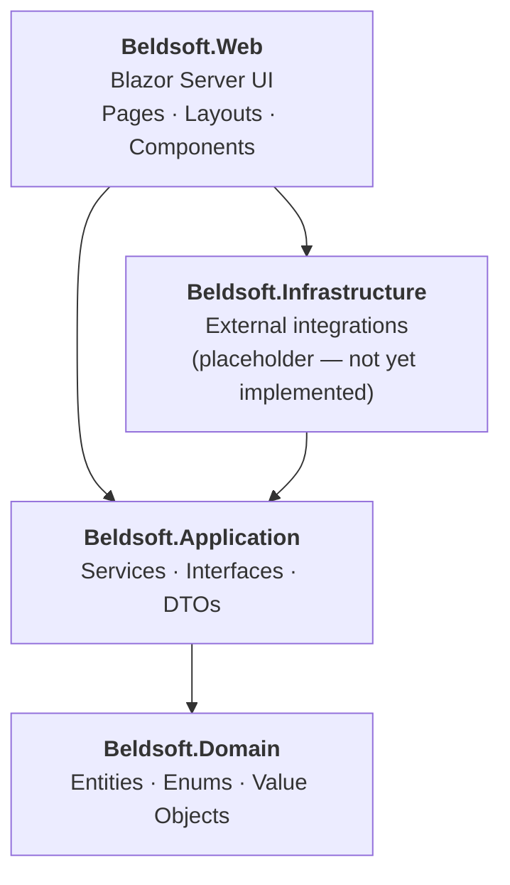
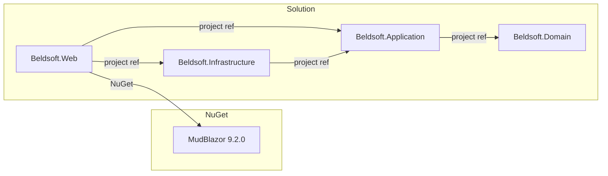
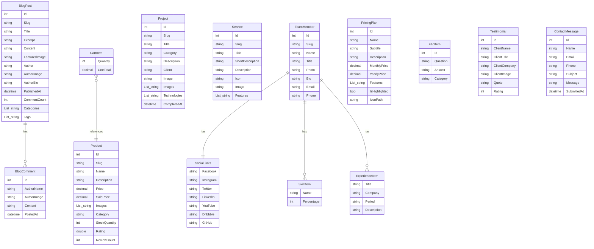
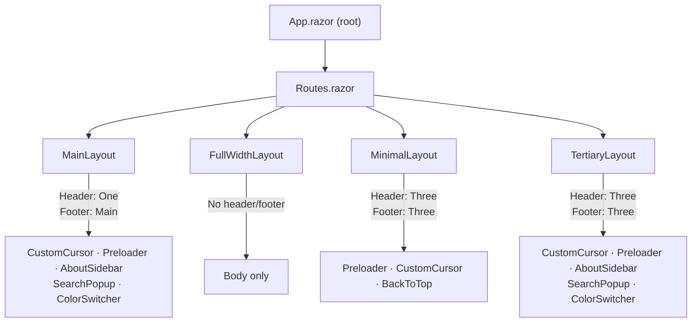
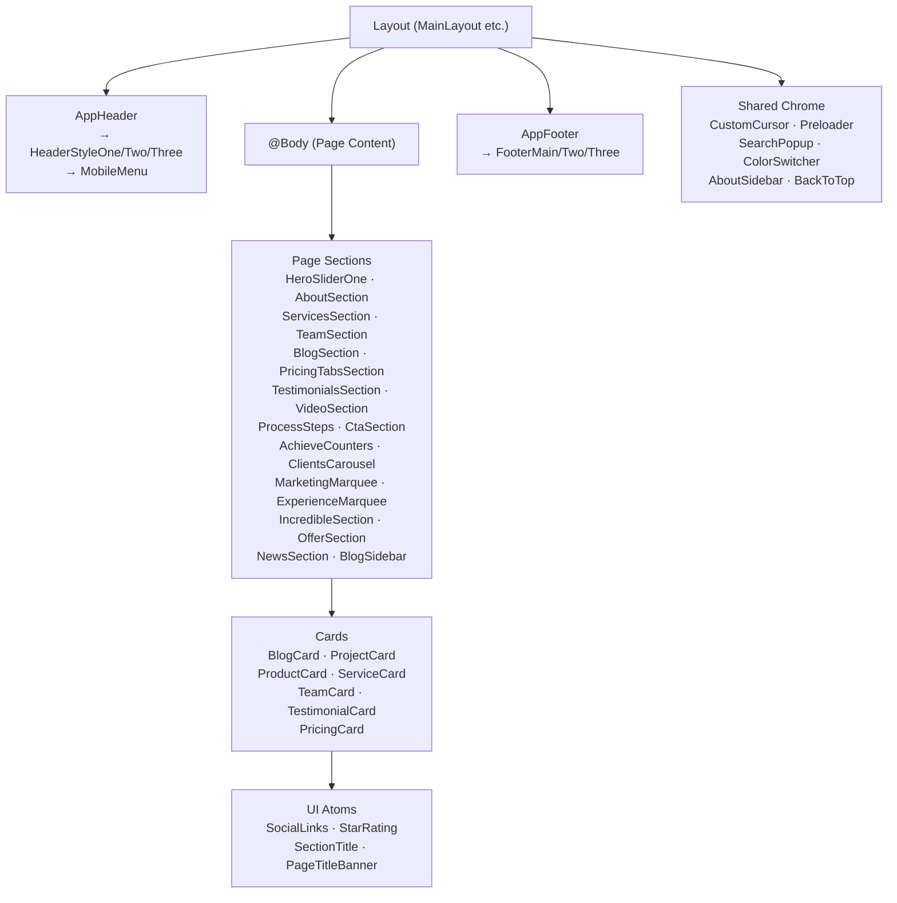
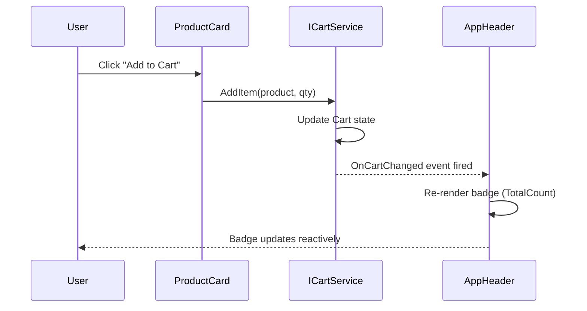
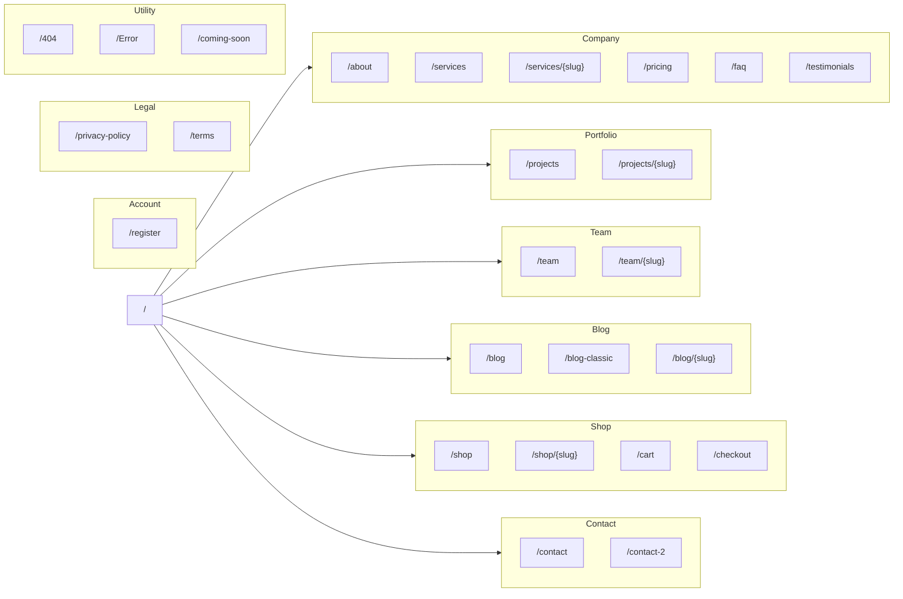
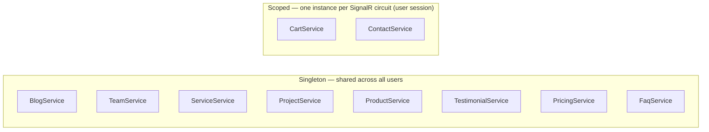

# Beldsoft

A corporate IT agency website built with **ASP.NET Core Blazor Server** (.NET 9) and **MudBlazor**. The application is a full marketing and portfolio website featuring a services showcase, project portfolio, team directory, blog, digital product shop with a live shopping cart, pricing plans, testimonials, FAQ, and contact forms.

---

## Table of Contents

- [Tech Stack](#tech-stack)
- [Solution Architecture](#solution-architecture)
- [Project Dependencies](#project-dependencies)
- [Domain Model](#domain-model)
- [Application Layer](#application-layer)
- [UI Architecture](#ui-architecture)
- [Pages & Routes](#pages--routes)
- [Service Lifetimes](#service-lifetimes)
- [Theming](#theming)
- [Getting Started](#getting-started)
- [Project Structure](#project-structure)

---

## Tech Stack

| Category | Technology |
|---|---|
| Runtime | .NET 9 |
| Web Framework | ASP.NET Core Blazor Server |
| UI Component Library | MudBlazor 9.2.0 |
| Interactivity | SignalR (Interactive Server render mode) |
| Language | C# 13 |
| Static Assets | `MapStaticAssets()` + `UseStaticFiles()` |
| Data Layer | In-memory hardcoded seed data (database-ready via Infrastructure layer) |
| Authentication | None (stub `Register` page only) |
| Fonts | Outfit (headings) · Manrope (body) · Raleway |

---

## Solution Architecture

The solution follows **Clean Architecture** with four projects. Dependencies flow strictly inward — outer layers depend on inner layers, never the reverse.



### Layer Responsibilities

| Project | Responsibility | Key Contents |
|---|---|---|
| `Beldsoft.Domain` | Core business rules; no dependencies | Entities, Enums, Value Objects |
| `Beldsoft.Application` | Use-case orchestration; depends on Domain | Service interfaces, Concrete services, DTOs |
| `Beldsoft.Infrastructure` | External integrations (DB, email, etc.) | *(empty placeholder — ready for implementation)* |
| `Beldsoft.Web` | Blazor UI shell; depends on Application + Infrastructure | Pages, Layouts, Components, `Program.cs` |

---

## Project Dependencies



---

## Domain Model

### Entity Relationship Overview



### Value Objects

| Type | Properties |
|---|---|
| `SocialLinks` | `Facebook?`, `Instagram?`, `Twitter?`, `LinkedIn?`, `YouTube?`, `Dribbble?`, `GitHub?` |
| `SkillItem` | `Name`, `Percentage` (0–100) |
| `ExperienceItem` | `Title`, `Company`, `Period`, `Description` |

### Enums

| Enum | Values |
|---|---|
| `HeaderVariant` | `One`, `Two`, `Three` |
| `FooterVariant` | `Main`, `Two`, `Three` |
| `ServiceCardVariant` | `Box`, `List`, `Icon` |
| `PricingInterval` | `Monthly`, `Yearly` |

---

## Application Layer

### Service Interfaces

```mermaid
classDiagram
    class IBlogService {
        +GetPostsAsync(page, pageSize) IEnumerable~BlogPostSummaryDto~
        +GetPostBySlugAsync(slug) BlogPostDto
        +GetRecentPostsAsync(count) IEnumerable~BlogPostSummaryDto~
        +GetCategoriesAsync() IEnumerable~string~
        +GetTotalCountAsync() int
    }

    class ICartService {
        +Cart CartDto
        +TotalCount int
        +AddItem(product, quantity)
        +RemoveItem(productId)
        +UpdateQuantity(productId, quantity)
        +Clear()
        +OnCartChanged event
    }

    class IContactService {
        +SubmitMessageAsync(form) bool
    }

    class IFaqService {
        +GetFaqItemsAsync() IEnumerable~FaqItemDto~
        +GetCategoriesAsync() IEnumerable~string~
    }

    class IPricingService {
        +GetPlansAsync() IEnumerable~PricingPlanDto~
    }

    class IProductService {
        +GetProductsAsync(page, pageSize) IEnumerable~ProductDto~
        +GetProductBySlugAsync(slug) ProductDto
        +GetRelatedProductsAsync(category, count) IEnumerable~ProductDto~
        +GetTotalCountAsync() int
    }

    class IProjectService {
        +GetProjectsAsync() IEnumerable~ProjectDto~
        +GetProjectBySlugAsync(slug) ProjectDto
    }

    class IServiceService {
        +GetServicesAsync() IEnumerable~ServiceDto~
        +GetServiceBySlugAsync(slug) ServiceDto
    }

    class ITeamService {
        +GetMembersAsync() IEnumerable~TeamMemberDto~
        +GetMemberBySlugAsync(slug) TeamMemberDto
    }

    class ITestimonialService {
        +GetTestimonialsAsync() IEnumerable~TestimonialDto~
    }
```



### DTOs

| DTO | Inherits | Notable Computed Properties |
|---|---|---|
| `BlogPostSummaryDto` | — | — |
| `BlogPostDto` | `BlogPostSummaryDto` | — |
| `BlogCommentDto` | — | — |
| `CartDto` | — | `Subtotal`, `Total`, `TotalCount` (all computed) |
| `CartItemDto` | — | `LineTotal = UnitPrice * Quantity` |
| `ContactFormDto` | — | Data annotations: `[Required]`, `[EmailAddress]` |
| `FaqItemDto` | — | — |
| `PricingPlanDto` | — | — |
| `ProductDto` | — | `DisplayPrice = SalePrice ?? Price` |
| `ProjectDto` | — | — |
| `ServiceDto` | — | — |
| `TeamMemberDto` | — | Reuses domain value objects directly (`SocialLinks`, `SkillItem[]`, `ExperienceItem[]`) |
| `TestimonialDto` | — | — |

---

## UI Architecture

### Layout System



| Layout | Header Variant | Footer Variant | Used By |
|---|---|---|---|
| `MainLayout` | `One` | `Main` | Most pages (Home, Blog, Shop, Projects, Team, etc.) |
| `FullWidthLayout` | none | none | Full-bleed pages |
| `MinimalLayout` | `Three` | `Three` | Utility pages (ComingSoon, Error, NotFound) |
| `TertiaryLayout` | `Three` | `Three` | Alternative style pages |

### Component Hierarchy



### Shopping Cart Data Flow



---

## Pages & Routes

### Navigation Map



### Full Page Inventory (26 pages)

| Route | File | Layout |
|---|---|---|
| `/` | `Home/HomePage1.razor` | MainLayout |
| `/about` | `Company/About.razor` | MainLayout |
| `/services` | `Company/Services.razor` | MainLayout |
| `/services/{Slug}` | `Company/ServiceDetail.razor` | MainLayout |
| `/pricing` | `Company/Pricing.razor` | MainLayout |
| `/faq` | `Company/Faq.razor` | MainLayout |
| `/testimonials` | `Company/Testimonials.razor` | MainLayout |
| `/projects` | `Portfolio/Projects.razor` | MainLayout |
| `/projects/{Slug}` | `Portfolio/ProjectDetail.razor` | MainLayout |
| `/team` | `Team/Team.razor` | MainLayout |
| `/team/{Slug}` | `Team/TeamDetail.razor` | MainLayout |
| `/blog` | `Blog/Blog.razor` | MainLayout |
| `/blog-classic` | `Blog/BlogClassic.razor` | MainLayout |
| `/blog/{Slug}` | `Blog/BlogDetail.razor` | MainLayout |
| `/shop` | `Shop/Shop.razor` | MainLayout |
| `/shop/{Slug}` | `Shop/ShopDetail.razor` | MainLayout |
| `/cart` | `Shop/Cart.razor` | MainLayout |
| `/checkout` | `Shop/Checkout.razor` | MainLayout |
| `/contact` | `Contact/Contact.razor` | MainLayout |
| `/contact-2` | `Contact/Contact2.razor` | MainLayout |
| `/register` | `Account/Register.razor` | MainLayout |
| `/privacy-policy` | `Legal/PrivacyPolicy.razor` | MainLayout |
| `/terms` | `Legal/Terms.razor` | MainLayout |
| `/404` | `Utility/NotFound.razor` | MinimalLayout |
| `/Error` | `Utility/Error.razor` | MinimalLayout |
| `/coming-soon` | `Utility/ComingSoon.razor` | MinimalLayout |

---

## Service Lifetimes



Read-only data services (blog, team, projects, etc.) are singletons because they serve the same static seed data to all users. `CartService` is scoped so each user has their own independent cart. `ContactService` is scoped to allow per-session contact form state isolation.

---

## Theming

MudBlazor theming is centralized in `BeldsoftTheme.cs`:

| Token | Value |
|---|---|
| Primary color | `#000DFF` (electric blue) |
| Secondary color | `#C115EC` (purple) |
| Background | `#FFFFFF` |
| Surface | `#F2F2F2` |
| Text primary | `#000000` |
| Text secondary | `#666666` |
| Error | `#FF3B30` |
| Success | `#34C759` |
| Warning | `#FF9500` |
| Border radius | `8px` |
| Heading font | Outfit (700 for H1–H2, 600 for H3–H6) |
| Body font | Manrope, 15px, line-height 1.7 |

A runtime **Color Switcher** component allows users to change the primary accent color without page reload.

---

## Getting Started

### Prerequisites

- [.NET 9 SDK](https://dotnet.microsoft.com/download/dotnet/9)

### Run Locally

```bash
# Clone the repository
git clone <repo-url>
cd beldsoft

# Restore dependencies
dotnet restore

# Run the web application (Development environment required for asset fingerprinting)
$env:ASPNETCORE_ENVIRONMENT = "Development"
dotnet run --project src/Beldsoft.Web/Beldsoft.Web.csproj
```

Open `https://localhost:5001` (or the port shown in terminal output).

> **Note:** `MapStaticAssets()` requires the `Development` environment to resolve fingerprinted asset manifests. Running without it will cause CSS/JS/Blazor assets to return 404.

### Build

```bash
dotnet build Beldsoft.sln
```

---

## Project Structure

```
Beldsoft.sln
└── src/
    ├── Beldsoft.Domain/                  # No dependencies — pure domain model
    │   ├── Entities/                     # BlogPost, Product, Project, Service,
    │   │                                 # TeamMember, Testimonial, PricingPlan,
    │   │                                 # FaqItem, CartItem, ContactMessage, BlogComment
    │   ├── Enums/                        # HeaderVariant, FooterVariant,
    │   │                                 # PricingInterval, ServiceCardVariant
    │   └── ValueObjects/                 # SocialLinks, SkillItem, ExperienceItem
    │
    ├── Beldsoft.Application/             # Use-case layer
    │   ├── Interfaces/                   # IBlogService, ICartService, IContactService,
    │   │                                 # IFaqService, IPricingService, IProductService,
    │   │                                 # IProjectService, IServiceService,
    │   │                                 # ITeamService, ITestimonialService
    │   ├── Services/                     # Concrete in-memory implementations
    │   └── DTOs/                         # BlogPostDto, ProductDto, CartDto, …
    │
    ├── Beldsoft.Infrastructure/          # External integrations (placeholder)
    │
    └── Beldsoft.Web/                     # Blazor Server application
        ├── Program.cs                    # DI registration, middleware pipeline
        ├── BeldsoftTheme.cs              # Centralized MudBlazor theme
        ├── appsettings.json
        ├── wwwroot/                      # Static assets (CSS, JS, images, fonts)
        └── Components/
            ├── App.razor                 # Root component
            ├── Routes.razor              # Router
            ├── _Imports.razor
            ├── Layout/
            │   ├── MainLayout.razor      # Full chrome (header One, footer Main)
            │   ├── FullWidthLayout.razor # Body only
            │   ├── MinimalLayout.razor   # Minimal chrome (header Three, footer Three)
            │   └── TertiaryLayout.razor  # Alt chrome (header Three, footer Three)
            ├── Pages/
            │   ├── Home/                 # HomePage1
            │   ├── Company/              # About, Services, ServiceDetail, Pricing, Faq, Testimonials
            │   ├── Portfolio/            # Projects, ProjectDetail
            │   ├── Team/                 # Team, TeamDetail
            │   ├── Blog/                 # Blog, BlogClassic, BlogDetail
            │   ├── Shop/                 # Shop, ShopDetail, Cart, Checkout
            │   ├── Contact/              # Contact, Contact2
            │   ├── Account/              # Register
            │   ├── Legal/                # PrivacyPolicy, Terms
            │   └── Utility/              # NotFound, Error, ComingSoon
            ├── Sections/                 # Large reusable page sections
            │   ├── HeroSlider/HeroSliderOne.razor
            │   ├── AboutSection.razor
            │   ├── ServicesSection.razor
            │   ├── TeamSection.razor
            │   ├── NewsSection.razor
            │   ├── PricingTabsSection.razor
            │   ├── TestimonialsSection.razor
            │   ├── VideoSection.razor
            │   ├── ProcessSteps.razor
            │   ├── CtaSection.razor
            │   ├── AchieveCounters.razor
            │   ├── ClientsCarousel.razor
            │   ├── MarketingMarquee.razor
            │   ├── ExperienceMarquee.razor
            │   ├── BlogSidebar.razor
            │   ├── IncredibleSection.razor
            │   └── OfferSection.razor
            ├── Cards/                    # BlogCard, ProjectCard, ProductCard,
            │                             # ServiceCard, TeamCard, TestimonialCard, PricingCard
            ├── Shared/                   # AppHeader (×3 styles), AppFooter (×3 styles),
            │                             # PageTitleBanner, SearchPopup, ColorSwitcher,
            │                             # CustomCursor, Preloader, BackToTop,
            │                             # AboutSidebar, SectionTitle
            └── UI/                       # SocialLinks, StarRating
```
